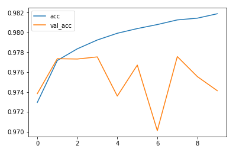
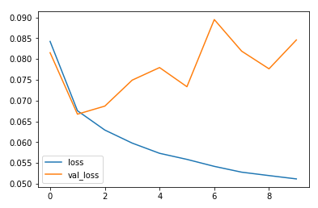

### Multi-label Toxic comment classification
in this project i have tried to use CNN for multi-label text classification to understand their efficiency or impact on text data. overall achived more than 97% validation accuracy which is significant. so assumption of using convolution network to extracting import features or word vectors in this case can help, Especially when trying to extract not so similar type of classification.(Note: for unintended bias in toxic comment please refer to other project wherre CNN was not so useful (https://github.com/DataDrivenGit/Unintended-Bias-in-Toxicity-Classification))

below are the accuracy and results obtained with simple 3 layer convolution network:

